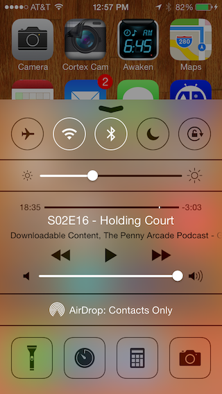
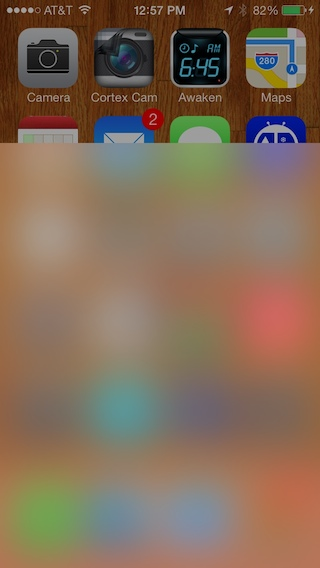
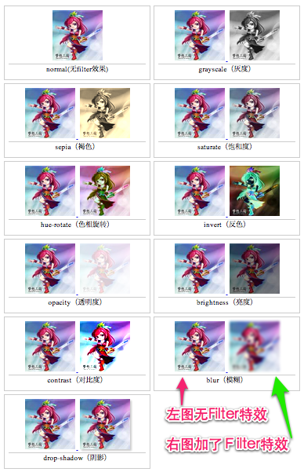
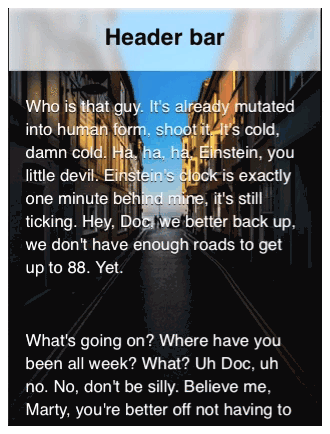
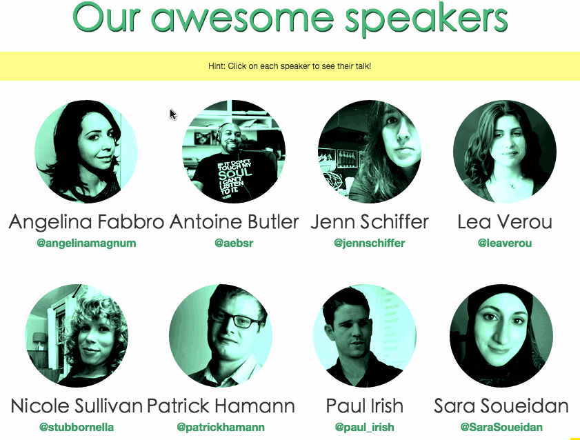
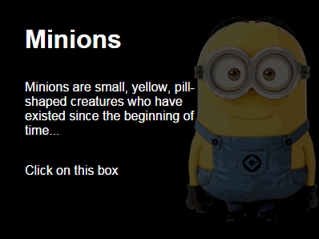

高级CSS filters
==============

在IOS系统上常常能看到高斯模糊（Gaussian Blur）效果，这种效果使用CSS来实现是比较痛苦的事情。其实，早在2011年，浏览器就开始对[CSS filters规范](http://www.w3.org/TR/filter-effects/)有所支持。也就是说在2011年浏览器就可以实现Filters效果，但这种效果基本上只运用在SVG上（只有SVG格式支持Filters效果），而且只有Firefox浏览器支持，并且只能运用在HTML上。这也造成了CSS要实现Filters是非常蛋疼的一件事。比如说下图的效果：





对于做原生开发的同学来说，这样的效果并不是难事（可以点击[这里](http://stackoverflow.com/questions/17036655/ios-7-style-blur-view)和[这里](http://stackoverflow.com/questions/17041669/creating-a-blurring-overlay-view)查看相关讨论），而我们是一名CSSer，我们坚持要用CSS来完成。

可能你首先想到的是[CSS的filter](http://www.w3cplus.com/css3/ten-effects-with-css3-filter)中的`blue()`或者[SVG中的filter](https://docs.webplatform.org/wiki/svg/tutorials/smarter_svg_filters)。但这些都不是新技术，而且到处也常见：

*	[CSS3 Filter的十种特效](http://www.w3cplus.com/css3/ten-effects-with-css3-filter)
*	[Understanding CSS Filter Effects](http://www.html5rocks.com/en/tutorials/filters/understanding-css/)
*	[filter](https://css-tricks.com/almanac/properties/f/filter/)
*	[CSS Filters](http://davidwalsh.name/css-filters)
*	[Understanding CSS filter effects](https://docs.webplatform.org/wiki/tutorials/css_filters)
*	[SVG滤镜的艺术以及它为什么这么棒](http://www.w3cplus.com/svg/why-the-svg-filter-is-awesome.html)
*	[SVG filters](https://docs.webplatform.org/wiki/svg/tutorials/smarter_svg_filters)

这些都不是CSS的新特性，那么什么是新特性呢？不知道你是否留意到Johan在《[Safari 9中有哪些新特性](http://www.johanbrook.com/writings/what-s-new-in-safari-9/)》一文中首先介绍的就是一个**[Backdrop filters](http://www.johanbrook.com/writings/what-s-new-in-safari-9/#backdrop-filters)**，而且在iamvdo的《[高级CSS filters](http://iamvdo.me/en/blog/advanced-css-filters)》对`backdrop-filter`属性做了详细介绍。那么今天这篇文章我们一起来看看通过CSS的新特性可以实现类似IOS系统中那种高斯模糊效果。

## `backdrop-filter`

`backdrop-filter`是在[Filter Level2](https://drafts.fxtf.org/filters-2/#BackdropFilterProperty)提出来的。其取值和[filter Level1](https://github.com/amfe/article/issues/9)中`filter`属性的属性值一样，包括：

*	[url](https://drafts.fxtf.org/filters/#typedef-url)

*	[blur()](https://drafts.fxtf.org/filters/#funcdef-blur)

*	[brightness()](https://drafts.fxtf.org/filters/#funcdef-brightness)

*	[contrast()](https://drafts.fxtf.org/filters/#funcdef-contrast)

*	[drop-shadow()](https://drafts.fxtf.org/filters/#funcdef-drop-shadow)

*	[grayscale()](https://drafts.fxtf.org/filters/#funcdef-grayscale)

*	[hue-rotate()](https://drafts.fxtf.org/filters/#funcdef-hue-rotate)

*	[invert()](https://drafts.fxtf.org/filters/#funcdef-invert)

*	[opacity()](https://drafts.fxtf.org/filters/#funcdef-opacity)

*	[saturate()](https://drafts.fxtf.org/filters/#funcdef-saturate)

*	[sepia()](https://drafts.fxtf.org/filters/#funcdef-sepia)

其效果如下：



既然`backdrop-filter`整出的效果和`filter`没有差别，那么还整个新属性出来，这不蛋疼？其实不是这样的，你是否发现过，最早在SVG上得到的`filter`效果，只能使用在SVG元素上；而`filter`使用在元素上，会直接影响后代所有元素。那么问题来了，如果只需要对元素的背景做`filter`效果，怎么破。这个时候就凸显了`backdrop-filter`的重要性。首先来看一个iamvdo录制的效果视频：

在线DEMO：

```

<iframe id="XbGeej" src="http://codepen.io/airen/embed/XbGeej?XbGeej=300&theme-id=0&slug-hash=XbGeej&default-tab=result&user=airen" scrolling="no" frameborder="0" height="300" allowtransparency="true" allowfullscreen="true" class="cp_embed_iframe undefined" style="width: 100%; overflow: hidden;"></iframe>

```

注：在你的浏览器中你是看不到任何效果，因为到目前为止仅有Safari 9浏览器支持，如果你想在浏览器中看到相应的效果，可以下载[Webkit Nightly](http://nightly.webkit.org/)浏览器。

回过头看，其只要的在`#elem`中使用：

```css

background: rgba(0,0,0,.2);
backdrop-filter: blur(2px) hue-rotate(180deg);

```

那么使用`backdrop-filter`可以实现我么你一直无法实现的高斯模糊效果。

```css

.header {
    background-color: rgba(255,255,255,.6);
    backdrop-filter: blur(5px)
}

```

么一个元素到达顶部`header`下面都会有一个`blur(5px)`的高斯模糊效果。

```

<iframe id="gpEGjZ" src="http://codepen.io/airen/embed/gpEGjZ?gpEGjZ=400&theme-id=0&slug-hash=gpEGjZ&default-tab=result&user=airen" scrolling="no" frameborder="0" height="400" allowtransparency="true" allowfullscreen="true" class="cp_embed_iframe undefined" style="width: 100%; overflow: hidden;"></iframe>

```

在上面的示例中，使用`@supports`属性来做一个条件判断，当浏览器支持`backdrop-filter`属性，就有效果：

```css

@supports (-webkit-backdrop-filter: none) {
  .Box-header {
      background: rgba(255,255,255,.6);
      -webkit-backdrop-filter: brightness(1.5) blur(4px);
  }
}

```

下面的GIF图展示了案例的真实效果：



`backdrop-filter`除了可以实现类似IOS系统的高斯模糊效果之外，还可以实现一些其他效果，比如说提高图像上文本的可读性，而且还可以结合多个`backdrop-filter`属性值，可以实现类似[CSS混合模式的图片合层](http://www.w3cplus.com/blog/tags/408.html)效果



## 使用`backdrop-filter`事项

在使用`backdrop-filter`时，有一些小细节需要注意：

*	运用`backdrop-filter`元素的背景应该是半透明，不然永远看不到效果
*	当`backdrop-filter`属性和裁剪属性（如`border-radius`、`mask`、`clip-path`等）结合在一起使用时，[会产生Bug](https://code.google.com/p/chromium/issues/detail?id=497522)
*	`backdrop-filter`可以创建一个堆栈文本（Stacking Context）,类似于`opacity`属性一样
*	可以配合动画属性`animation`一起使用
*	到目前为止，仅有Safari浏览器支持，而且还需要添加前缀`-webkit-backdrop-filter`如果你使用[autoprefixer 这样的插件](https://github.com/postcss/autoprefixer)无须考虑前缀相关事项

## 浏览器兼容性

可以通过CanIUse查看各个浏览器厂商对`backdrop-filter`的兼容：

```

<iframe src="http://caniuse.com/css-backdrop-filter/embed" scrolling="no" frameborder="0" height="300" allowtransparency="true" allowfullscreen="true" style="width: 100%; overflow: hidden;"></iframe>

```

## filter()

在2012年的一篇文章[CSS Filter的十种特效](http://www.w3cplus.com/css3/ten-effects-with-css3-filter)介绍过`filter`属性，如果你使用过这个属性制作一些效果，一定又发现，他会直接影响其后代元素，优点类似`opacity`。很多时候，只希望元素的背景做效果调整，又不希望他会影响其他元素。而且有没有`backdrop-filter`属性的情形下，`filter()`就显得格外的重要。

在继续往下阅读之前，你要注意一点，`filter()`并不等于以前介绍过的`filter`属性，简单的理解，一个是函数，一个是属性。那么我们今天要说的是`filter()`函数。为了更好的与`filter`属性区分，`filter()`函数接受两个参数：

```

filter(<url>, <filter-function-list>)

```

其中`<url>`是指一个图像，`<filter-function-list>`是一个过滤器。这两个结合在一起将会返回一个处理过的新图像。如：

```css

.element {
    background: filter(url(path/to/img.jpg), blur(5px));
}

```

因此，你可以给图片使用过滤效果，然后填充到元素中，比如`background-filter`、`background-opacity`、`background-blur`等等。如下图所示：


上面展示了，给背景图使用了不同过滤属性得到的不同效果。效果是很完美的，但是浏览器对其支持力度相当的差，到目前为止，也仅有Safari 9支持。

## 注意事项

*	规范总定义的[过滤函数](http://www.w3.org/TR/filter-effects/#FilterCSSImageValue)
*	和[background-size属性](http://www.w3cplus.com/content/css3-background-size)属性一起使用会有Bug
*	支持动画
*	需要添加前缀：`-webkit-filter()`

值得一提的是，`backdrop-filter`和`filter()`可以使用CSS3的`transition`和`animation`实现一些平滑的过渡效果或动画，甚至还可以使用JavaScript

比如下面所示的效果：



## 总结

虽然使用SVG或者CSS3的`filter`属性能实现类似的效果，但我还是非常的期待浏览器能支持`backdrop-filter`和`filter()`函数的特性。这样可以通过一行简单的CSS代码就能实现很多特殊（以前依赖于图片）的效果。当然，这些特性能让我们快速实现需要的一些特殊效果，但在性能上会有很大的影响，根据以前使用`filter`属性的经验来看，这两个属性对性能的影响也将不小。

除此之外，虽然浏览器支持力度很小，但在IOS系统上我们即将可以使用这样的特性。最常见的一个可以拿这两个特性实现高斯模糊。

本文转自[高级CSS filters-@大漠](https://github.com/amfe/article/issues/9)


